<!-- START doctoc generated TOC please keep comment here to allow auto update -->
<!-- DON'T EDIT THIS SECTION, INSTEAD RE-RUN doctoc TO UPDATE -->


- [Advanced Node](#advanced-node)
  - [Intro](#intro)
    - [Node's Architecture: V9 and libuv](#nodes-architecture-v9-and-libuv)
    - [Node's CLI and REPL](#nodes-cli-and-repl)
    - [Global Object, Process, and Buffer](#global-object-process-and-buffer)
      - [process](#process)
      - [Buffer](#buffer)
    - [How require() Actually Works](#how-require-actually-works)
      - [module object](#module-object)
      - [module.exports](#moduleexports)
    - [JSON and C++ Addons](#json-and-c-addons)
    - [Wrapping and Caching Modules](#wrapping-and-caching-modules)
      - [Caching](#caching)
    - [Know Your NPM](#know-your-npm)
      - [Update](#update)
      - [Config](#config)
  - [Concurrency Model and Event Loop](#concurrency-model-and-event-loop)
    - [The Event Loop](#the-event-loop)
    - [The Call Stack](#the-call-stack)
    - [Handling Slow Operations](#handling-slow-operations)
    - [How Callbacks Actually Work](#how-callbacks-actually-work)
    - [setImmediate and process.nextTick](#setimmediate-and-processnexttick)
  - [Node's Event-driven Architecture](#nodes-event-driven-architecture)
    - [Callbacks, Promises and Async/Await](#callbacks-promises-and-asyncawait)
    - [Event Emitter](#event-emitter)
    - [Arguments, Errors, and Orders of Listeners](#arguments-errors-and-orders-of-listeners)
    - [Practical Example: Task List Manager](#practical-example-task-list-manager)
  - [Node for Networking](#node-for-networking)
    - [TCP Networking with the Net Module](#tcp-networking-with-the-net-module)
    - [Working with Multiple Sockets](#working-with-multiple-sockets)
    - [Improving the Chat Server](#improving-the-chat-server)
    - [The DNS Module](#the-dns-module)
    - [UDP Datagram Sockets](#udp-datagram-sockets)

<!-- END doctoc generated TOC please keep comment here to allow auto update -->

# Advanced Node

> Notes from [Advnaced Nodejs](https://app.pluralsight.com/library/courses/nodejs-advanced/table-of-contents) course.

## Intro

### Node's Architecture: V9 and libuv

- Node's default VM is V8 (maybe future another option is Microsoft's js engine Chakra - which powers Edge browser)
- Node uses V8 to execute js code -> js features available in Node are the features supported by V8 engine shipped with Node

```shell
node -p 'process.versions.v8'
6.2.414.54
```

Support is manage db "V8 Feature Groups":

- Shipping: On by default
- Staged: Not on by default, but can use cli flags to enable, almost complete.
- In Progress: Like Staged, but less stable.

`v8` module can be required at run time, eg from node repl, useful function is `getHeapStatistics` to get memory usage:

```javascript
> v8
{ cachedDataVersionTag: [Function: cachedDataVersionTag],
  getHeapStatistics: [Function: getHeapStatistics],
  getHeapSpaceStatistics: [Function: getHeapSpaceStatistics],
  setFlagsFromString: [Function: setFlagsFromString],
  Serializer: [Function: Serializer],
  Deserializer: [Function: Deserializer],
  DefaultSerializer: [Function: DefaultSerializer],
  DefaultDeserializer: [Function: DefaultDeserializer],
  deserialize: [Function: deserialize],
  serialize: [Function: serialize] }
> v8.getHeapStatistics()
{ total_heap_size: 7684096,
  total_heap_size_executable: 3670016,
  total_physical_size: 6462896,
  total_available_size: 1491807064,
  used_heap_size: 5287584,
  heap_size_limit: 1501560832,
  malloced_memory: 8192,
  peak_malloced_memory: 1193984,
  does_zap_garbage: 0 }
```

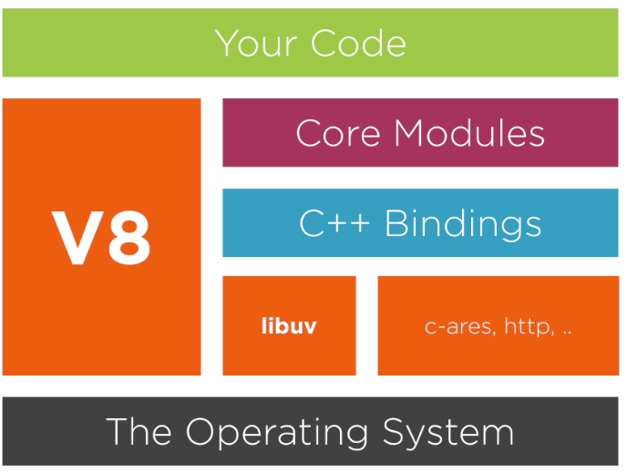

- Node uses V8 via V8's C++ API.
- Node itself has an API that developers can use in JavaScript (eg: interact with file system, network, timers etc.).
- Node API executes C++ code using V8 object and function templates.
- Node handles waiting for asynchronous events using `libuv`.
- When Node is done waiting for I/O operations or timers, usually there is a callback function to invoke, when time to invoke, Node passes control to V8
- When V8 done with the callback, control passed back to Node
- V8 is single-threaded therefore Node cannot execute any more JS while it's running
- libuv is a c library developed for node - abstract non blocking I/O operations with consistent interface across various OS's
- libuv handles filesystem operations, tcp and udp sockets, child processes
- libuv has thread pool to handle what can't be done asynchronously in OS
- libuv provides Node with Event Loop

Besides V8 and libuv, more Node dependencies:

- `http-parser`: Small C library for parsing http messages, works with requests and responses.
- `c-ares`: For performing asynchronous DNS queries.
- `OpenSSL`: Used in TLS and crypto modules, provides implementations for cryptographic functions.
- `zlib`: Used for fast, async, streaming compression/decompression interfaces.

### Node's CLI and REPL

From Node REPL, tab tab or global.tab lists all functions available globally. All top-level functions/modules available in Node. In REPL, many native modules are pre-loaded and available in global scope. But for regular script, `console.log(global)` will show what's available.

.tab or .help will show some available commands (break, clear, editor, etc):

```
> .help
.break    Sometimes you get stuck, this gets you out
.clear    Alias for .break
.editor   Enter editor mode
.exit     Exit the repl
.help     Print this help message
.load     Load JS from a file into the REPL session
.save     Save all evaluated commands in this REPL session to a file
```

What architecture node is running on: `node -p "process.arch"`

Number of processors node sees: `node -p "os.cpus()"`

### Global Object, Process, and Buffer

There is only one global object in node named `global`.

When declaring a variabel in a module, it's local to that module and cannot be accessed from other files:

```javascript
// util.js
var answer = 42;
// index.js
require("./util");
console.log(answer); // ReferenceError: answer is not defined
```

But if a variable is defined on the global object, it's available everywhere:

```javascript
// util.js
global.answer = 42;
// index.js
require("./util");
console.log(answer); // 42
```

Best practice: Avoid use of `global`!

Should be familiar with all properties defined in `global` 0 Array, Boolean, Date,Error, EvalError, Function, Infinity, etc (list comes up in node repl after hitting tab tab).

Most important objects available on global are `process` and `Buffer`.

#### process

Provides bridge between node app and its running environment. Has useful properties such as:

`process.versions` - output node and all its dependencies versions:

```
node -p "process.versions"
{ http_parser: '2.8.0',
  node: '8.11.3',
  v8: '6.2.414.54',
  uv: '1.19.1',
  zlib: '1.2.11',
  ares: '1.10.1-DEV',
  modules: '57',
  nghttp2: '1.32.0',
  napi: '3',
  openssl: '1.0.2o',
  icu: '60.1',
  unicode: '10.0',
  cldr: '32.0',
  tz: '2017c' }
```

Could use this for control flow, eg:

```javascript
if (process.versions.v8 < "4") {
  // do something for old v8s...
}
```

Most useful process property is env: `node -p "process.env"` exposes copy of user environment (same as `env` on linux). Note this is a _COPY_. If modify such as `process.env.USER = 'foo'`, does not modify the actual user environment.

Best practice: Do ot read from `process.env` directly. Better is to put all settings in a config module, then use that in rest of app:

```javascript
// util.js
export const config = {
  port: process.env.PORT || 8080
};
// index.js
const { config } = require("./util");
config.port; // 8080 of PORT env not set
```

To display latest used LTS release: `node -p "process.release.lts"` (eg: `Carton`). If not on an LTS release will return `undefined`. Can use to show a warning if production is being started on a non-LTS version.

Most useful feature of `process` is to communicate with the environment - use standard streams: `stdin` for read and `stdout` for write and `stderr` to write errors. These are pre-established ready streams and cannot be closed.

`process` object is instance of event emitter. It can emit and listen for events. One event to be aware of is `exit` - emitted when event loop has nothing else to do or when manual call to `process.exit(code)` has been executed. Can't stop node from exiting but could log or send alert. Any code in exit listener must be synchronous. Cannot use event loop here.

```javascript
process.on("exit", code => {
  // do one final synchronous operation before the node process terminates
});
```

Another useful event is `uncaughtException`, emitted when a js exception occurs and is not handled, bubbles all the way through event loop. Default behaviour is to print stack trace and exit. Unlike `exit`, registering a handler here can prevent Node from exiting.

```javascript
process.on("uncaughtException", err => {
  // something went unhandled
  // not good practice to prevent exit, let it die and use a process monitor to restart instead
  // do any cleanup and exit anyway!
});
```

[Example exit vs uncaughtException](examples/process-exit-uncaught.js)

#### Buffer

Used to work with binary streams of data:

```
node
> Buffer
{ [Function: Buffer]
  poolSize: 8192,
  from: [Function],
  alloc: [Function],
  allocUnsafe: [Function],
  allocUnsafeSlow: [Function],
  isBuffer: [Function: isBuffer],
  compare: [Function: compare],
  isEncoding: [Function],
  concat: [Function],
  byteLength: [Function: byteLength],
  [Symbol(node.isEncoding)]: [Function] }
>
```

A chunk of memory allocated outside of the V8 heap. Can put some data in that memory. Data can be interpreted in a few ways depending on length of chracter. Must always specify character encoding when placing content in `Buffer`.

When reading from files or sockets, if don't specify encoding, get a Buffer object.

Lower level data structure to represent a sequence of binary data. Once allocated, cannot be resized (unlike array).

Options for creating Buffer:

`Buffer.alloc(8)`: Create a filled buffer of certain size.

`Buffer.allocUnsafe(8)`: Does not fill the created buffer. Might contain old/sensitive data and need to be filled immediately with: `Buffer.allocUnsafe(8).fill()`. It's faster than `alloc` but security issue because can read things that were previosly in memory.

Example:

```javascript
// allocate 800 byte Buffer without initializing it
// trying to read its content, will see some data
Buffer.allocUnsafe(800).toString();
```

Can also create Buffer using `from` method. Accepts different arguments.

```javascript
const string = "touchè"; // example of UTF8 string
const buffer = Buffer.from("touchè"); // did not specify character encoding, so will use Buffer's internal UTF8 representation

console.log(string, string.length); // touchè 6 <- character count based on default UTF8 encoding
console.log(buffer, buffer.length); // <Buffer 74 6f 75 63 68 c3 a8> 7 <- number of bytes
```

Buffer useful for reading things like image file from tcp stream, compressed file, any form of binary data.

Can use operations like `includes`, `indexOf`, `slice`, but some differences from Array and string behaviour.

`slice` operation on Buffer, shares same memory with original Buffer. [Example](examples/buff-slice.js)

When converting streams of binary data, use `StringDecoder` module because it handles multi-byte characters better than Buffer's `toString` method.

[Example](examples/string-decoder.js)

### How require() Actually Works

2 core modules involved in modularity:

`require` function available on global object.

`module` module, also available on global object.

When executing `require('something')`, Node goes through folowing sequence:

- Resolving to find absolute file path of a module
- Loading is determined by content of file at resolved path
- Wrapping gives every module a private scope, makes require local to every module
- Evaluating eventually done by V8 on the code
- Caching - when module required again, don't need to go through all the steps again

#### module object

```javascript
// examples/module.js
console.log(module)
// outputs
Module {
  id: '.',
  exports: {},
  parent: null,
  filename: '/.../examples/module.js',
  loaded: false,
  children: [],
  paths:
  [ '/.../examples/node_modules',
    '/.../node_modules',
    '/.../projects/pluralsight/node_modules',
    '/.../projects/node_modules',
    '/.../node_modules',
    '/Users/node_modules',
    '/node_modules' ] }
```

Node modules have 1-1 relationship with file on filesystem. A module is required by loading content of file into memory.

Before module can be loaded, must be found. Will search in `Module.paths` as seen from above output. If not found in any path, throws `Cannot find module` Error.

For core node modules, eg: `const fs = require('fs)`, resolve step returns immediately, doesn't need to go looking for it in `paths`.

Given following dir structure:

```
.
├── index.js
└── node_modules
    └── find-me.js
```

```javascript
// index.js
console.log("In ./index.js");
require("find-me");

// find-me.js
console.log("In ./node_modules/find-me.js");
```

Then running `node index.js` outputs:

```
In ./index.js
In ./node_modules/find-me.js
```

If there was another `find-me.js` at `~/node_modules/find-me.js`, then it will not be loaded because Node stops looking when it finds the closest ones.

Can also load a directory. Example, if `find-me` was a dir containing `index.js`:

```
.
├── index.js
└── node_modules
    └── find-me
        └── index.js  // console.log('In ./node_modules/find-me/index.js');
```

Now runing `node index.js` from project root:

```
In ./index.js
In ./node_modules/find-me/index.js
```

By default, when loading a dir, node looks for `some-dir/index.js`, but can change the default behaviour in `package.json`. For example, if want to load `start.js` instead of `index.js` when `find-me` dir is required, configure package to indicate when this package is required, `start.js` is the file that should be loaded:

```javascript
// package.json
{
  "name": "find-me",
  "main": "start.js"
}
```

```
.
├── index.js
└── node_modules
    ├── find-me
    │   ├── index.js
    │   ├── package.json
    │   └── start.js
```

```
node index.js
In ./index.js
In ./node_modules/find-me/start.js
```

If want to resolve a module but not execute, use `require.resolve`:

```javascript
// index.js
require.resolve("find-me"); // will still throw error if find-me cannot be found
```

`resolve` useful for checking whether optional package is installed.

Module can also be located anywhere, and required with relative (starting with `.` or `..`) or absolute paths (starting with `/`). Examples:

Given this dir structure:

```
.
├── index.js
├── lib
│   └── find-me.js
└── node_modules
    ├── old-find-me
    │   ├── index.js
    │   ├── package.json
    │   └── start.js
    └── old-find-me.js
```

```javascript
// index.js
console.log("In ./index.js");
console.log(module);
require("./lib/find-me");

// lib/find-me.js
console.log("In ./lib/find-me.js");
console.log(module);
```

Output of `node index.js`. Note how global `module` object actually has differently populated properties for each module. eg: `id` of find-me module is full path whereas index.js id is just `.`.

```
In ./index.js
Module {
  id: '.',
  exports: {},
  parent: null,
  filename: '/.../examples/how-require-works/index.js',
  loaded: false,
  children: [],
  paths:
   [ '/.../examples/how-require-works/node_modules',
     '/.../examples/node_modules',
     '/.../node_modules',
     '/.../projects/pluralsight/node_modules',
     '/.../projects/node_modules',
     '/.../node_modules',
     '/Users/node_modules',
     '/node_modules' ] }
In ./lib/find-me.js
Module {
  id: '/.../examples/how-require-works/lib/find-me.js',
  exports: {},
  parent:
   Module {
     id: '.',
     exports: {},
     parent: null,
     filename: '/.../examples/how-require-works/index.js',
     loaded: false,
     children: [ [Circular] ],
     paths:
      [ '/.../examples/how-require-works/node_modules',
        '/.../examples/node_modules',
        '/.../node_modules',
        '/.../projects/pluralsight/node_modules',
        '/.../projects/node_modules',
        '/.../node_modules',
        '/Users/node_modules',
        '/node_modules' ] },
  filename: '/.../examples/how-require-works/lib/find-me.js',
  loaded: false,
  children: [],
  paths:
   [ '/.../examples/how-require-works/lib/node_modules',
     '/.../examples/how-require-works/node_modules',
     '/.../examples/node_modules',
     '/.../node_modules',
     '/.../projects/pluralsight/node_modules',
     '/.../projects/node_modules',
     '/.../node_modules',
     '/Users/node_modules',
     '/node_modules' ] }
```

#### module.exports

`exports` is a special object on `module`. eg: if required module `find-me.js` has:

```javascript
console.log("In ./lib/find-me.js");
console.log(module);
exports.id = "find-me";
```

And `index.js` that requires it has:

```javascript
console.log("In ./index.js");
console.log(module);
const findMeExports = require("./lib/find-me");
console.log("findMeExports: ", findMeExports); // findMeExports:  { id: 'find-me' }
```

Note in above examples, `loaded` property of module was false because Node was still in process of loading it.

If change `find-me.js` to run in `setImmediate` timer, to be executed in next round of event loop, then `module.loaded` will be true:

```javascript
setImmediate(() => {
  console.log("In ./lib/find-me.js");
  console.log(module);
  exports.id = "find-me";
});
```

But in this case, `const findMeExports = require('./lib/find-me');` from index.js will be `{}`, cannot use exports object inside timers.

### JSON and C++ Addons

`require` will try to resolve modules by file extensions in the following order:

1. .js
2. .json - if found, will be parsed as json text file
3. .node (compiled addon module, which is a C++ binary) [addons doc](https://nodejs.org/api/addons.html)

[JSON example](examples/file-extensions/index.json) Useful when just need to export some static config data. However, good practice to specify `.json` extension in require to call it out that it's not a js module:

```javascript
// index.js
const config = require('./config.json');
// do something with config...

// config.json
{
  "host": "0.0.0.0",
  "port": 8000
}
```

To compile node addons:

Copy `hello.cc` from node addons doc to `examples/file-extensions/addon-src`.

```shell
npm i -g node-gyp
cd examples/file/extensions/addon-src
node-gyp configure  # creates makefile under build dir
node-gyp build  # creates binary file examples/file-extensions/addon-src/build/Release/addon.node
cp build/Release/addon.node ../node_modules
```

Then can require it:

```javascript
const addon = require("addon");
console.log(addon.hello()); // world
```

- To see extension support, run `require.extensions` from repl.
- For `.js`, node simply compiles the module
- For `.json`, uses `JSON.parse`
- For `.node`, uses `process.dlopen`

```
node
> require.extensions
{ '.js': [Function], '.json': [Function], '.node': [Function] }
>
> require.extensions['.js'].toString()
'function (module, filename) {\n  var content = fs.readFileSync(filename, \'utf8\');\n  module._compile(internalModule.stripBOM(content), fil
ename);\n}'
>
> require.extensions['.json'].toString()
'function (module, filename) {\n  var content = fs.readFileSync(filename, \'utf8\');\n  try {\n    module.exports = JSON.parse(internalModule
.stripBOM(content));\n  } catch (err) {\n    err.message = filename + \': \' + err.message;\n    throw err;\n  }\n}'
>
> require.extensions['.node'].toString()
'function (module, filename) {\n  return process.dlopen(module, path._makeLong(filename));\n}'
```

### Wrapping and Caching Modules

Can use export object to export properties, but not allowed to replace exports object directly. To replace exports object, need to use `module.exports` syntax. Also variables declared in module are local to that module unless exported.

```javascript
exports.id = 1; // this is ok
exports = { id: 1 }; // this is not ok
module.exports = { id: 1 }; // this is ok
// WHY CAN'T EXPORTS OBJECT BE DIRECLTY REPLACED??

var g = 42; // local to this file
// HOW ARE VARIABLES MAGICALLY SCOPED??
```

Before compiling a module, node wraps it in a function. This function wrapping process keeps top level variables in a module scoped to that module. It also makes the module's exports and require variables appear to be global but they are specific to each module.

```
node
> require('module').wrapper
[ '(function (exports, require, module, __filename, __dirname) { ',
  '\n});' ]
```

`__filename` and `__dirname` contain module's absolute filename and directory path respectively.

To see anonymous function wrapper in action, run a script with an error:

```javascript
// index.js
abcdefg;
```

```shell
node index.js
.../examples/wrapping/index.js:1
(function (exports, require, module, __filename, __dirname) { abcdefg;
                                                              ^

ReferenceError: abcdefg is not defined
    at Object.<anonymous> (.../examples/wrapping/index.js:1:63)
    at Module._compile (module.js:652:30)
    at Object.Module._extensions..js (module.js:663:10)
    at Module.load (module.js:565:32)
    at tryModuleLoad (module.js:505:12)
    at Function.Module._load (module.js:497:3)
    at Function.Module.runMain (module.js:693:10)
    at startup (bootstrap_node.js:191:16)
    at bootstrap_node.js:612:3
```

Since every module is running in a wrapper function, can access the function's arguments:

```javascript
// index.js
console.log(arguments);
// output
{ '0': {},  // first arg is empty exports object
'1':  // require object
 { [Function: require]
   resolve: { [Function: resolve] paths: [Function: paths] },
   main:
    Module {
      id: '.',
      exports: {},
      parent: null,
      filename: '/.../examples/wrapping/index.js',
      loaded: false,
      children: [],
      paths: [Array] },
   extensions: { '.js': [Function], '.json': [Function], '.node': [Function] },
   cache:
    { '/.../examples/wrapping/index.js': [Object] } },
'2':  // module object
 Module {
   id: '.',
   exports: {},
   parent: null,
   filename: '/.../examples/wrapping/index.js',
   loaded: false,
   children: [],
   paths:
    [ '/.../examples/wrapping/node_modules',
      '/.../examples/node_modules',
      '/.../node_modules',
      '/.../projects/pluralsight/node_modules',
      '/.../projects/node_modules',
      '/.../node_modules',
      '/Users/node_modules',
      '/node_modules' ] },
'3': '/.../examples/wrapping/index.js',  // filename
'4': '/.../examples/wrapping' }  // dirname
```

require and module object are copies associated with the running module (index.js in this case), not global variables.

Wrapping function's return value is the `exports` object reference. `exports` in wrapper function is a variable reference to `module.exports` in the module code. It's as if every module had this line at the top:

```javascript
let exports = module.exports;
```

This is why we can change properties of `exports` but not re-assign it because them it owuld no longer be a reference to `module.exports`.

`require` is simply a function that takes the module name or path and returns the `exports` object.

`require` can be overridden to perform other logic. Eg for testing, may want every `require` line to be mocked by default and only return an empty object. Can do this with re-assignment of `require` object:

```javascript
require = function() {
  return { mocked: true };
};

const fs = require("fs");
console.log("fs"); // {mocked: true}
```

[Example to understand require object](examples/wrapping/printStars.js)

Given a function that takes two numeric arguments:

```javascript
// printStars.js
const print = (stars, header) => {
  console.log("*".repeat(stars));
  console.log(header);
  console.log("*".repeat(stars));
};
```

Wnat to use it in two different ways:

1. cli `node printStars.js 5 hello`
2. require in another module:
   ```javascript
   // index.js
   const printStars = require("./printStars");
   printStars(10, "Hi!");
   ```

Solution is to add this if statement at end of `printStars.js`:

```javascript
// printStars.js
const print = ...

if (require.main == module) {
  // Running as a script
  print(process.argv[2], process.argv[3]);
} else {
  // Being required
  module.exports = print;
}
```

#### Caching

Suppose have a module `ascii-art.js` that dispays some ascii art:

```javascript
// ascii-art.js
console.log("...");
```

Want the display every time module is required, but that won't work because of module caching:

```javascript
// index.js
require("./ascii-art"); // will display once
console.log(require.cache);
require("./ascii-art"); // but not again because first time got cached
```

Cache can be inspected using `require.cache`.

```javascript
{ '/.../examples/caching/index.js':
 Module {
   id: '.',
   exports: {},
   parent: null,
   filename: '/.../examples/caching/index.js',
   loaded: false,
   children: [ [Object] ],
   paths:
    [ '/.../examples/caching/node_modules',
      '/.../examples/node_modules',
      '/.../node_modules',
      '/.../projects/pluralsight/node_modules',
      '/.../projects/node_modules',
      '/.../node_modules',
      '/Users/node_modules',
      '/node_modules' ] },
'/.../examples/caching/ascii-art.js':
 Module {
   id: '/.../examples/caching/ascii-art.js',
   exports: {},
   parent:
    Module {
      id: '.',
      exports: {},
      parent: null,
      filename: '/.../examples/caching/index.js',
      loaded: false,
      children: [Array],
      paths: [Array] },
   filename: '/.../examples/caching/ascii-art.js',
   loaded: true,
   children: [],
   paths:
    [ '/.../examples/caching/node_modules',
      '/.../examples/node_modules',
      '/.../node_modules',
      '/.../projects/pluralsight/node_modules',
      '/.../projects/node_modules',
      '/.../node_modules',
      '/Users/node_modules',
      '/node_modules' ] } }
```

Notice that the `ascii-art.js` file is in the cache, indexed by the full file path. It can be removed:

```javascript
// index.js
require("./ascii-art");
console.log(require.cache);
delete require.cache["/.../examples/caching/ascii-art.js"];
require("./ascii-art"); // will display ascii art again this time
```

But this is not good solution. Better is to wrap the console.log in ascii-art.js in a function and export that. Then when requiring it, execute the exports object as a function:

```javascript
// ascii-art.js
module.exports = () => {
  console.log("...");
};
// index.js
require("./ascii-art")();
require("./ascii-art")();
```

### Know Your NPM

Comes packaged with node. Consists of npm cli and npm registry.

npm cli can be used with other registries, local files, folders, private registries, git repos.

To install express from last commit on master branch from github (org/repo):

```shell
npm i expressjs/express
```

Can confirm the commit with `npm ls express`

```
/.../examples/know-npm
└── express@4.16.4  (github:expressjs/express#dc538f6e810bd462c98ee7e6aae24c64d4b1da93)
```

Can also install from specific commit, tag or branch:

```shell
npm i expressjs/express#4.14.0
```

To check what package a command will install without actually installing it, use `--dry-run` option:

```shell
npm i some-pkg --dry-run
```

To see list of globally installed packages, `npm ls -g` will list all top level packages and their dependencies, which is probably more than what you wanted to see. Use `--depth` option to control depth of display tree:

```shell
npm ls -g --depth=0
```

To view more information about installed packages, use `ll`:

```shell
npm ll -g --depth=0
```

If reading output of `npm ls` programmatically and need to parse it, use `--json` option:

```shell
npm ls -g --depth=0 --json
```

When saving local dependencies, to save as production dep: (`dependencies` section of `package.json`)

```shell
npm i -S request
```

To save as dev dep: (`devDependencies` section of `package.json`)

```shell
npm i -D babel-cli
```

To save as optional dep, use for recommended tool that's not required: (`optionalDependencies` section of `package.json`)

```shell
npm i -O nodemon
```

For optional deps, code should check for existence and only use if installed.

#### Update

Use `npm update` to either update a single installed package or all packages. Will update according to a version range specified in `pakcage.json`.

Version range consists of operator and version. Operator could be `<`, `<=`, `=`:

```javascript
{
  "dependencies": {
    "request": "<2.79.0",
    "babel-cli": "<=6.18.0",
    "nodemon": "=1.11.0"
  }
}
```

Equal operator is default if no operator specifified.

`x` or `*` can be used in any of the major/minor/patch semver numbers to cover the whole range for that number, eg: `"2.79.x"`. It's equivalent to not specifying that level at all, eg: `"2.79"`.

`~` operator is equivalent to having `x` in the last level but only where x is greater than what's specified, eg: `"~1.2.3"` is nearly the same as `"1.2.x"` but only where `x` is greater than or equal to `3`.

`^` operator is good for packages that are < 1.0 because it only allows changes that do not modify the left-most non zero digit in semver.

To check if any package is outdated (add `-g` to check globally installed packages):

```shell
npm outdated -g
```

#### Config

To view all config options:

```shell
npm config list -l
```

Example usage, can change default `init` setttings used in `npm init`:

```shell
npm config list -l | grep init
npm config set init-author-name "John Doe"
```

To delete overridden setting:

```shell
npm config delete init-author-name
```

Another useful config is to have `npm i` always save by default:

```shell
npm config set save true
```

Use `search` command to search npm registry:

```shell
npm search lint
```

`home` command to open homepage of a package in browser, `repo` to open repository page:

```shell
npm home lodash
npm repo lodash
```

If you have packages installed in `node_modules` folder but not saved in `package.json`, use `npm prune` to cleanup.

Easter egg: `npm xmas`

## Concurrency Model and Event Loop

### The Event Loop

Definition: The entity that handles external events and converts them into callback invocations.

Alternate definition: A loop that picks events from the event queue and pushes their callbacks to the call stack.

Node automatically starts event loop when executing a script, this is what makes asynchronous callback style programming possible. Node exits event loop when there are no more callbacks to perform.

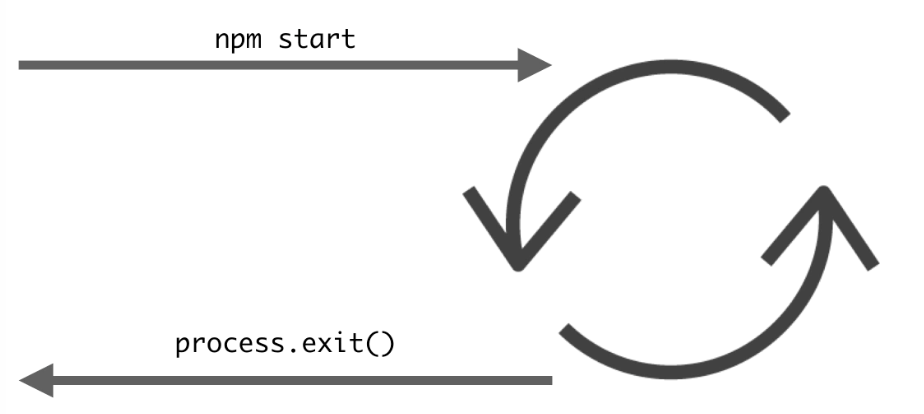

Note: Event loop also present in browsers, similar to what's running in Node.

To understand event loop, need to understand all the parts of the system it interacts with including Heap, Stack and Queue.

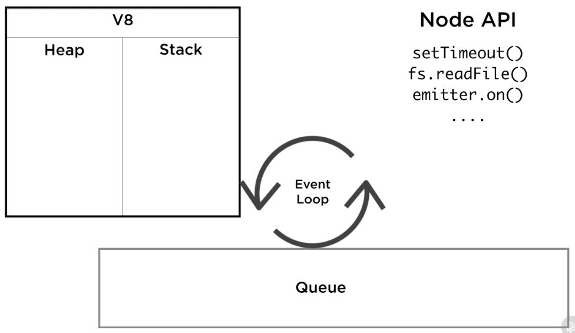

Stack will be covered later.

Heap is where objects are stored in memory. This is the memory that is allocated by V8 for tasks, eg: when invoking a function, space in heap is allocated to be local scope for function.

Heap and Stack are part of runtime engine, not Node itself.

Node adds APIs, eg: timers, emitters, wrappers around OS operations.

Node also provides Event Queue and Event Loop using `libuv` library.

Event Loop is a loop that works between Event Queue and call Stack.

### The Call Stack

- Part of V8, list of functions.
- First In Last Out data structure.
- Top element that is popped out is most recent element that was pushed in
- In V8, elements in callstack are _functions_
- JS is single threaded -> only one stack, only one thing is running at a time
- When invoke a function that calls another that calls another etc, this forms a stack.
- As functions return, invocations backtracked all the way back to first caller.
- When a function is stepped into, it gets pushed to stack, when return from a funcion, it gets popped out of stack.
- When function is added to stack, includes its arguments and local variables -> Stack Frame: function, arguments and local vars
- When an error occurs, console displays state of callstack when error occurred
- If function calls itself recursively with no exit condition - equivalent to infinite loop but on stack, will keep pushing function invocatiosn on stack until reach V8 size limit for stack: Maximum call stack size exceeded

### Handling Slow Operations

Single threaded model is ok if all operations on stack are fast, but is a problem for slow operations because they will block execution, nothing else can happen.

Node event loop is designed to avoid this.

### How Callbacks Actually Work

Function gets passed as argument to a function, which gets executed at a later point in time... but how does this happen?

```javascript
// this function gets pushed onto stack and executed AFTER slowAdd has returned
function cb() {
  console.log(a + b);
}
const slowAdd = (a, b) => {
  setTimeout(cb, 5000); // setTimeout returns immediately, pushed and popped from stack
};
slowAdd(3, 3);
slowAdd(4, 4);
```

_Event Queue_ is list of things to be executed.

- First-in First-out data structure.
- First event queued will be first to be dequeued.
- To dequeue an event from queue, its associated function is invoked.
- Invoking a function pushes it to stack

Call Stack

- setTimeout(cb1, d)
- slowAdd(3, 3)
- anonymous()

When Node sees call to setTimeout API, instantiates a timer _outside_ of javascript runtime.

- setTimeout call is popped out of stack
- while Node timer is running, stack is free to continue processing items:
- pops slowAdd(3,3)
- pushes slowAdd(4.4)
- pushes setTimeout(cb2, d)
- Node kicks off another timer for cb2
- stack continues - pops setTimeout, slowAdd
- after 5 seconds, both timers complete
- when each timer completes, it queues its associated callback into the Event Queue

**Now event loop has work to do**
Event loop monitors call stack and event queue:

When call stack is empty:

- While queue is not empty:
- event = dequeue an event
- if there is a callback:
- call the event's callback (this pushes callback function to stack)
- keeps looping until event queue is empty

When both call stack and queue are empty - idle state - node will exit process when this state is reached.

### setImmediate and process.nextTick

Consider same code as earlier, but timer delay = 0:

```javascript
const slowAdd = (a, b) => {
  setTimeout(() => {
    console.log(a + b);
  }, 0);
};

slowAdd(3, 3);
slowAdd(4, 4);
```

Main function `anonymous()` gets pushed on stack:

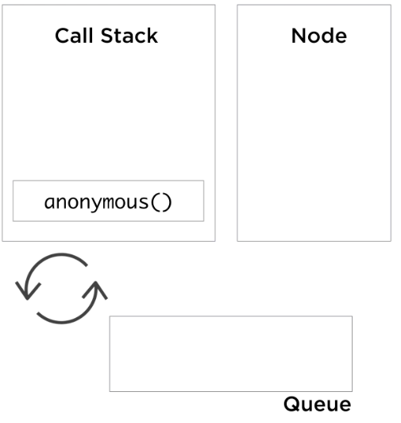

Main function pushes `slowAdd(3,3)` on stack:

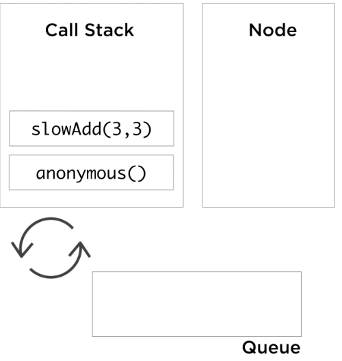

`slowAdd(3,3)` pushes `setTimeout(cb1,d)` on stack:

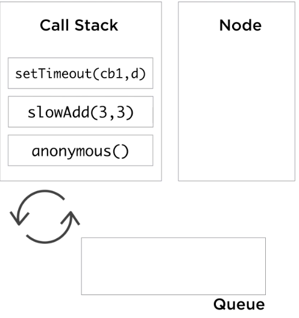

`setTimeout(cb1,d)` creates a timer `cb1`

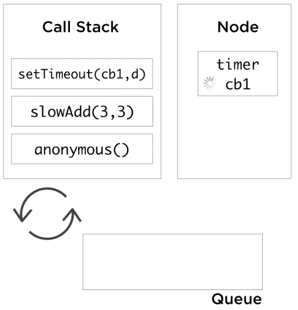

Timer immediately queues it's callback `cb1` on the queue


Event loop will NOT process the `cb1` callback because the stack is not empty, so stack continues it's normal flow...

`setTimeout(cb1,d)` completes and is popped off the stack

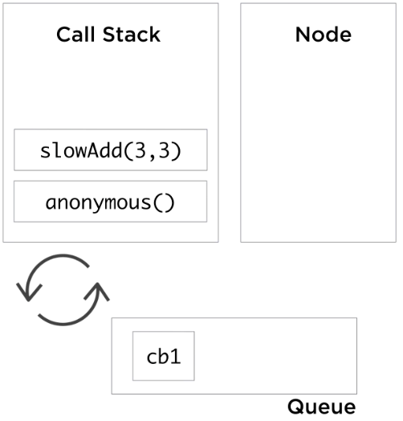

`slowAdd(3,3)` completes and is popped off the stack

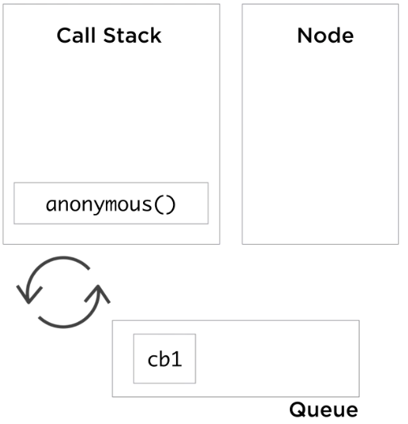

`slowAdd(4,4)` is pushed onto stack, which in turn pushes `setTimeout(cb2,d)`

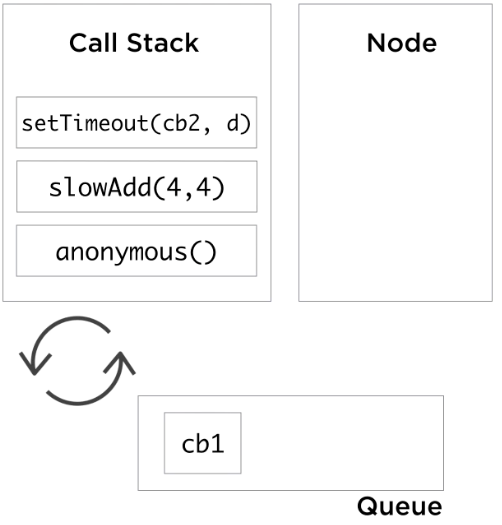

`setTimeout(cb2,d)` creates a timer `cb2`

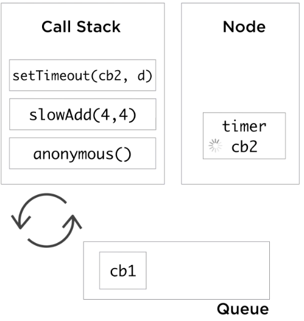

Timer immediately queues it's callback `cb2` on the queue

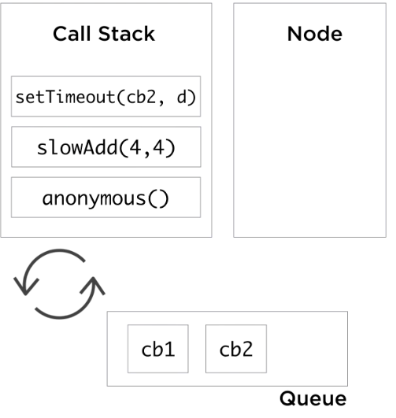

Event loop will STILL NOT process any of the callbacks in the queue because stack is not empty...

`setTimeout(cb2,d)`, `slowAdd(4,4)`, then `anonymous()` complete in turn and are popped off the stack

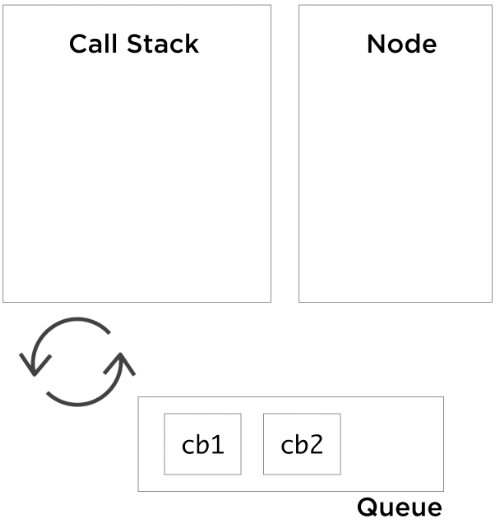

Now that stack is empty, event loop picks first callback `cb1` and pushes it to stack

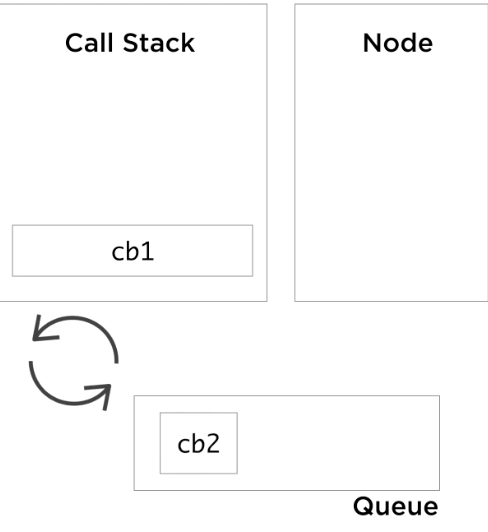

`cb1` executes `console.log(6)`

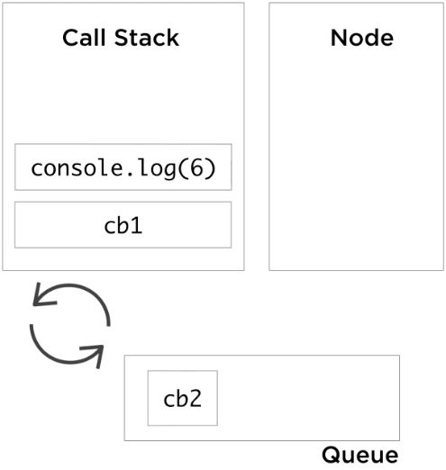

Same process repeated for `cb2`.

**Implications**

- Timer callbacks are NOT executed after 0 ms, but rather, after stack has been processed.
- If there was a slow operation on the stack, timers would have to wait for it to complete.
- Delay defined in timer is not guaranteed, but rather a minimum time to execution.

**Event Loop Phases**

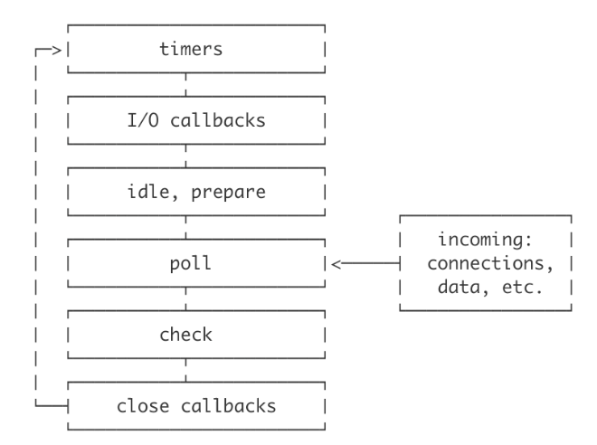

Timers run in a different phase than most I/O operations.

`setImmediate` timer runs in a different phase of the event loop. Mostly the same as 0 delay `setTimeout` except sometimes `setImmediate` will take precedence over other previously set 0 delay `setTimeout`s.

Example - this code always displays `immediate` _before_ `timeout`, even though `setTimeout` is run before `setImmediate`.

```javascript
const fs = require("fs");

fs.readFile(__filename, () => {
  setTimeout(() => {
    console.log("timeout");
  }, 0);
  setImmediate(() => {
    console.log("immediate");
  });
});
```

_Always use setImmediate when you want something executed on next tick of event loop_

Confusing - there is also `process.nextTick` API which is similar to `setImmediate`, but does not execute its callback on the next tick of event loop.

`process.nextTick` is not part of event loop and doesn't care about phases of event loop. Node will process callbacks registered with `nextTick` _after_ the current operation completes and _before_ the event loop continues. Useful and dangerous!

Example where `process.nextTick` useful:

[examples/process-next-tick.js](examples/process-next-tick.js)

## Node's Event-driven Architecture

### Callbacks, Promises and Async/Await

- Asynchronous calls used to be all callbacks.
- Callbacks are just functions you pass to other functions, node uses this together with event loop but...
- Callbacks !== Asynchrony

[Example callback style](examples/file-callback.js)

[Example converted to promise style](examples/file-promise.js)

[Example to support both callbacks and promises](examples/file-cb-promise.js)

[Example consuming cb/promise impl with async function](examples/file-async.js)

### Event Emitter

Module that facilitates communication between objects in Node -> asynchronous event driven architecture.

Many built-in modules inherit from event emitter:

- import: `const EventEmitter = require('events)`;
- extend: `class Logger extends EventEmitter {}`
- init: `const logger = new Logger();`
- emit: `logger.emit('event');`
- addListener: `logger.on('event', listenerFunc);`

Emitter objects emit named events that cause listeners to be called. Emitter object has two features:

1. Emitting named events, eg: `logger.emit('event');`
2. Registering listener functions, eg: `logger.on('event', listenerFunc);`

To work with event emitters, create a class that extends EventEmitter and instantiate it. Use `emit` function to emit any named event.

Emitting an event is a signal that some condition has occurred. Usually, its about a state change in the emitting object.

Listener functions are added using `on` function. Listener function will be executed every time emitter objects emits the associated named event.

[Synchronous Example](examples/event-emitter.js)

Like with callbacks, don't assume events imply asynchronous code, can be synchronous as seen in above example.

Benefit of events over callbacks: Can react to same signal multiple times by defining multiple listeners. Useful for applications to allow multiple external plugins to build functionality on top of the application's core.

Think of events as "hook points" to allow for customizing the story around a state change.

[Asynchronous Exmaple](example/event-emitter-async.js)

### Arguments, Errors, and Orders of Listeners

For EventEmitter, can use as many arguments as you wish after named event, all args will be passed to listener functions, from previous exaple:

```javascript
this.emit("data", data);
// ...
// data argument from emitter is available to registered listener function:
withTime.on("data", data => {
  console.log(`length: ${data.length}`);
});
```

Error event is special, if there is no listener, node process will crash and exit if error is emitted. Need something like:

```javascript
withTime.on("error", console.error);
```

Alternatively, can register listener for `uncaughtException` event:

```javascript
process.on("uncaughtException", err => {
  console.log(err);
  // cleanup...
  process.exit(1); // best practice: exit anyway
});
```

But what if multiple errors are emitted at the same time? Will cause issue for cleanup code in `uncaughtException` handler. Solution is to use event emitter module's `once` method instead of `on`, to invoke listener just once:

```javascript
process.once("uncaughtException", err => {
  console.log(err);
  // cleanup...
  process.exit(1); // best practice: exit anyway
});
```

If multiple listeners are registered for same event, then invocation will happen in order in which they are registered :

```javascript
withTime.on("data", data => {
  // this will run first...
});
withTime.on("data", data => {
  // this will run second...
});
```

If you need to register a listener later but want it to run first, use `prependListener` method:

```javascript
withTime.prependListener("data", data => {
  // I will always run first!
});
```

Can also use `removeListener` method.

### Practical Example: Task List Manager

[Client](examples/task-list/client.js) | [Server](examples/task-list/server.js)

- Client emits command event for server
- Server emits response event for client
- Commands: help, ls, add, delete

Client needs to read input from user, use `readline` module.

Server will implement instance method for every command.

When server initialized, will emit response "Type a command", but at time of construction of server, client has not yet had a chance to register server response listener. Solution: use `process.nextTick` in server constructor:

```javascript
class Server extends EventEmitter {
  constructor(client) {
    super();
    process.nextTick(() => {
      this.emit("response", "Type a command (help to list commands)");
    });
    ...
  }
}
```

`add` command needs arguments. Will provide from client side by parsing input, use array destructuring to pull out command, separately from rest of arguments:

```javascript
let command, args;
rl.on("line", input => {
  [command, ...args] = input.split(" ");
  client.emit("command", command, args);
});
```

## Node for Networking

### TCP Networking with the Net Module

[Example](examples/networking/basic-server.js)

Use `net` module's `createServer` method:

```javascript
process.stdout.write("\u001B[2J\u001B[0;0f");
const server = require("net").createServer();

// register connection handler that fires every time a client connects to this server
// handler exposes connected socket
// socket object implements duplex stream interface - i.e. can read and write to it
server.on("connection", socket => {
  console.log("Client connected");
  socket.write("Welcome new client!\n");
});

// Run server by listening on a port
server.listen(8000, () => console.log("Server bound"));
```

To test, in one tab, run: `node basic-server.js`, in another, use netcat:

```shell
nc localhost 8000 # welcome message sent to client
```

Node process keeps running because connection not terminated.

Client can write to socket but we have to register a handler to read from the socket.

socket === duplex stream -> i.e. socket is also an event emitter. Can listen to `data` event on socket. Handler for this event exposes buffer object.

```javascript
socket.on("data", data => {
  console.log("data is:", data);
});
```

To test, in client console type in any text such as `hello`. Will be received by server as buffer, eg:

```
data is: <Buffer 68 65 6c 6c 6f 0a>
```

Buffer - node does not assume any encoding so client could be typing in any language.

To echo data back to user, use `socket.write`:

```javascript
socket.on("data", data => {
  console.log("data is:", data);
  socket.write("data is: ");
  socket.write(data); // if not specified, assumes UTF8 encoding so data will be echoed back to client as string
});
```

Can set encoding globally:

```javascript
socket.setEncoding("utf8"); // data argument on data event will now be a string
```

Use socket `end` event to handle when client disconnects, then can no longer write to the socket:

```javascript
socket.on("end", () => {
  console.log("Client disconnected");
});
```

To test, disconnect netcat session with control+D

### Working with Multiple Sockets

[Multiple Sockets](examples/networking/multiple-sockets.js)

In previous example, many clients can connect to same server, just open more terminal windows and start netcat session. Each connected client gets its own socket. Modify example to give each socket a unique id.

```javascript
let counter = 0;
...
server.on('connection', socket => {
  socket.id = counter++;
  ...
  socket.on("data", data => {
    socket.write(`${socket.id}: `);
    ...
  });
});
```

To make clients "chat" with each other, when server receives data on one socket, it should write to all connected sockets. Need to keep track of all connected sockets and loop over them in `data` handler. Use `sockets` object for tracking:

```javascript
let counter = 0;
let sockets = {};
// ...
server.on("connection", socket => {
  socket.id = counter++;
  sockets[socket.id] = socket;
  // ...
});
// ...
socket.on("data", data => {
  Object.entries(sockets).forEach(([, clientSocket]) => {
    clientSocket.write(`${socket.id}: `);
    clientSocket.write(data);
  });
});
```

Now we have a chat server because every connected client receives all messages from every other connected client.

But if one client disconnects, then another client sends data, chat server will crash because trying to write to connection that was closed.

To fix this, on `end` event, delete the socket from `sockets` tracker object:

```javascript
socket.on("end", () => {
  delete sockets[socket.id];
});
```

### Improving the Chat Server

[Chat Server](examples/networking/chat-server.js)

Usually with chat, don't get echo back of your own message. Fix this with condition on `data` method:

```javascript
socket.on("data", data => {
  Object.entries(sockets).forEach(([key, clientSocket]) => {
    if (socket.id == key) return;
    clientSocket.write(`${socket.id}: `);
    clientSocket.write(data);
  });
});
```

Further improvement, rather than identifying clients by id/number, ask for their name when they connect. This means first data event after initial connection will be client's name. Need condition to capture this.

```javascript
server.on("connection", socket => {
  // ...
  socket.write("Please type your name: ");
  // ...
  socket.on("data", data => {
    if (!sockets[socket.id]) {
      // if get here, have not yet registered this client, capture their name now
      socket.name = data.toString().trim();
      socket.write(`Welcome ${socket.name}!\n`);
      sockets[socket.id] = socket;
      return;
    }
    Object.entries(sockets).forEach(([key, clientSocket]) => {
      if (socket.id == key) return;
      clientSocket.write(`${socket.name}: `);
      clientSocket.write(data);
    });
  });
});
```

Another improvement - show timestamp on each message:

```javascript
function timestamp() {
  const now = new Date();
  return `${now.getHours()}:${now.getMinutes()}`;
}
// ...
Object.entries(sockets).forEach(([key, clientSocket]) => {
  if (socket.id == key) return;
  clientSocket.write(`${socket.name} ${timestamp()}: `);
  clientSocket.write(data);
});
```

### The DNS Module

[Example](examples/dns.js)

Use to translate network name to address and vice versa.

`lookup` function looks up address by host and returns err first callback:

```javascript
const dns = require("dns");

dns.lookup("pluralsight.com", (err, address) => {
  console.log(address); // 54.191.212.90
});
```

`lookup` method doesn't perform network request directly, uses underlying OS facilities to perform name resolution. This mean sit uses `libuv` threads. All other `dns` methods use network directly so do not need `libuv` threads.

Equivalent to `lookup` is `resolve4` which will return array of addresses in case domain has multiple A records

```javascript
dns.resolve4("pluralsight.com", (err, address) => {
  console.log(address); // [ '54.191.217.222', '54.70.118.65', '54.191.212.90' ]
});
```

Using `resolve` method returns same result as `resolve4` because default second argument is `A`:

```javascript
dns.resolve("pluralsight.com", "A", (err, address) => {
  console.log(`resolve A: ${JSON.stringify(address)}`);
});
```

Can resolve other types:

```javascript
dns.resolve("pluralsight.com", "MX", (err, address) => {
  console.log(`resolve MX: ${JSON.stringify(address)}`);
  // [{"exchange":"us-smtp-inbound-1.mimecast.com","priority":10},{"exchange":"us-smtp-inbound-2.mimecast.com","priority":20}]
});
```

All the types have equivalent method names, eg `dns.resolveMx`.

`reverse` method takes in IP and returns err first callback with hostnames:

```javascript
dns.reverse("54.70.118.65", (err, hostnames) => {
  console.log(`reverse: ${JSON.stringify(hostnames)}`);
  // ["ec2-54-70-118-65.us-west-2.compute.amazonaws.com"]
});
```

### UDP Datagram Sockets

[Example](examples/udp.js)

Use `dgram` module - implementation for udp datagram sockets. For simplicity, example includes server and client implementation in same file.

Every time new socket is created, will use a different port.

First argument to `send` can be string or Buffer. When using buffer, must specify where to start (offset) and length to send.

Can also send array of messages.
